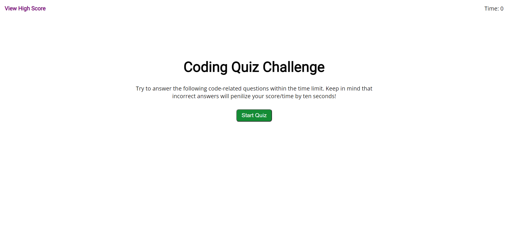
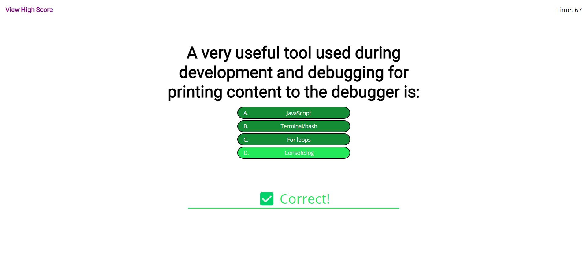
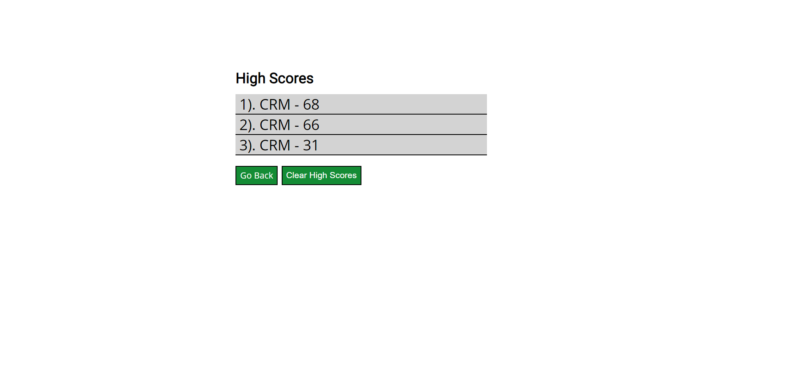

# JavaScript Fundamentals Quiz

## Description
A quiz with over some basic Javascript fundamentals. Test your progress with a highscore tracker that displays your best times! Get a problem incorrect and lose time off your over all score.

#### Link:

[https://millerchase.github.io/javascript-fundamentals-quiz/](https://millerchase.github.io/javascript-fundamentals-quiz/)

#### Examples:

## Made with:

- JavaScript
- HTML
- CSS

## Contribution

Made by Chase Miller. 🤘😎
